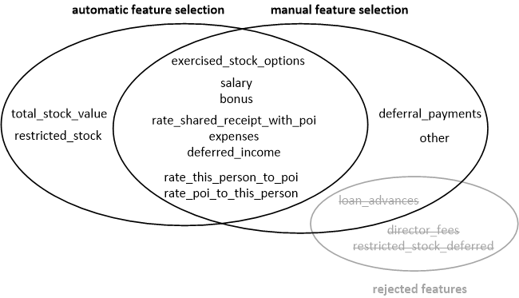

```{r load data and functions, warning=FALSE, message=FALSE, echo=FALSE, fig.width=10, fig.height=10}
setwd("h:/Dokumente/GitHub/DAND_5_MachineLearningEnronData/final_project")
source(file="batch_analyzer.R")
```

&nbsp;


&nbsp;

# Objective
## Which questions did we try to answer in the process?

This machine learning project tries to identify Persons of Interest from the 
Enron Scandal. The [Enron Scandal][scandal] was the largest case of corporate 
fraud in the history of the United States. Several people were indigted or 
imprisoned. Large amounts of money were misappropriated. People involved in
the Enron scandal are called "Persons of Interest" (poi) in this assignment.

We are building a machine learning algorithm that can, given some financial
data of an employee and some data from the so-called [Enron Corpus][corpus] 
predict if that person could be a person of interest.

[scandal]: https://en.wikipedia.org/wiki/Enron_scandal
[corpus]: https://en.wikipedia.org/wiki/Enron_Corpus

## How does the dataset we choose help?

Many Persons of Interest were main benefactors from the fraud and therefore 
took away huge sums of money, either as salary, bonus, as stock options or as 
other compensations. The Enron Corpus moreover gives an idea about which 
employees were in frequent contact with one another. From this data source we 
hope to get insights how information about malpractices spreaded through the 
company.

## How is machine learning useful in this context?

No single feature about a person (financial or email-related) can give us 
a clear yes-no answer about whether a person is "of interest" or not. 
Machine Learning helps us discover patterns in the interplay of the features
available to us. It should also give us an opportunity to predict whether 
persons are "of interest" when we see new data, of which we do not have any
information yet as to whether they are "of interest" (meaning: being involved
in the scandal) or not.

## Were there any outliers? How did you handle them?

The financial data included one outlier, a person "named" "TOTAL". It's
financial features were strangely far from the other data points; this 
data point was probably included while scrapping the financial data 
off a table from a web page or document. I hard codedly removed the data 
point from the data set as preproecessing step.


# Feature Selection

## What features did you use? What selection process did you use?

I tried both manual feature selection after initial explorative analysis of
the data and automatic feature selelction using the ```SelectKBest```
preprocessor. 

For explorative data analysis I implemented a helper class which shows some
GUI windows with POIs and non-POIs highlighted in different color. An example
window is shown below; the window is capable of displaying multiple plots
in a tabbed view. It is also possible to control certain display parameters
like number of histogram bins or alpha transparency with a spinner widget.

This GUI can be shown when calling the ```poi_id.py``` script with the options 
```-g univariate_analysis``` and ```-g bivariate_analysis``` respectively. 


&nbsp;

You can force the classifier into manual feature selection mode by 
using option ```-f False```. In this case, I chose to use the following list
of default features:

```
salary, bonus, deferral_payments, loan_advances, expenses, 
  exercised_stock_options, deferred_income, other, rate_poi_to_this_person,
  rate_this_person_to_poi, rate_shared_receipt_with_poi
```

For some classifiers, this manual feature selection actually performed better 
than automatic feature selection. More about this in the section
[Algorithms](#Algorithms) Since the algorithm of our choosing was among those,
we are not using automatic feature selection by default. If you want to force 
```poi_id.py``` to run _with_ automatic feature selection, supply the option
```-f True```.

## Did you have to do any scaling? Why (not)?

The algorithm of our final choosing, a KNeighbors algorithm, did perform better
without scaling (F1 score), as did some other algorithms. I found that this was
true for all algorithms using Principal Component Analysis. PCA does in fact
select axis based on feature variance and MinMaxScaler decreases this variance
drastically by rescaling features to 0..1
([source](http://sebastianraschka.com/Articles/2014_about_feature_scaling.html)).

More on how feature scaling worked for different pipeline configurations in 
section [Algorithms](#Algorithms).

Some algorithms I tried did however need scaling to run at all.
For example, the Support Vector Classifier with polynomial kernel (to be testet
amongst other values in ```GridSearchCV```) did not terminate within 45 minutes
runtime on my machine if scaling was turned off.

When running the pipeline using ```poi_id.py```, feature scaling can be turned
on or off by using ```-s True``` or ```-s False```. Default is "off".

## Which features did you try to make and why?

Three features were derived from the features ```from_this_person_to_poi```,
```from_poi_to_this_person```, ```shared_receipt_with_poi```:

$\text{rate_poi_to_this_person} = \frac{\text{from_poi_to_this_person}}{\text{from_messages}}$

$\text{rate_this_person_to_poi} = \frac{\text{from_this_person_to_poi}}{\text{to_messages}}$

$\text{rate_shared_receipt_with_poi} = \frac{\text{shared_receipt_with_poi}}{\text{to_messages}}$

The rationale behind creating those features is that some people might write
less, some people might write more emails. We really want to look at what 
is the percentage of emails someone wrote to a person of interest in order
to estimate how likely they were to be involved in malpractices of other
persons of interest.

I did, however, leave the original features in the data set for the case of 
automatic feature selection with ```SelectKBest``` and used this as a 
validation technique of those newly created features. I cannot assume a 
direct linear corellation with those features, therefore, they should not
prove an obstacle to the algorithm.

## Which were the feature scores for SelectKBest? How did you choose the SelectKBest parameters?

The image below shows the SelectKBest results for different classifiers.
Every classifier used the same set of 9 automatically selected features (shown
on the x-axis). I limited the number of features to 12. This was also the number of
features I picked as relevant features when deactivating automatic feature selection.

```{r features, warning=FALSE, message=FALSE, echo=FALSE, fig.width=12, fig.height=8}
plot_features(featurescores.display, clf.labels) +
  ggtitle("Features Selected by SelectKBest")
```

As can be seen from the following diagram, the majority of the features 
selected by ```SelectKBest``` were also already selected manually during the
explorative analysis. A surprise was, that the two ```rate_*``` features did 
not make it into the list. 



&nbsp;


<a name="#Algorithms" />
# Algorithms

## What algorithm did you end up using? What other one(s) did you try?
I tried a variety of algorithms, all selectable with the ```-c <clf_id>``` 
option supplied to ```poi_id.py```. Each algorithm, I ran as a baseline
and then tried improving the classifier by one or more of the following:

* Wrapping the algorithm in a ```AdaboostClassifier``` if the algorithm
supported weights (```DecisionTree``` or ```RandomForest```).
* Wrapping the algorithm in a ```GridSearchCV``` if the algorithm 
supported one or more tunable parameters (see 
[Tuning the Algorithm](#Tuning-the-Algorithm)).
* Adding RandomizedPCA

I tried the following algorithms (in that order):

0. Gaussian Naive Bayes (```-c 0```): worked as a minimum viable product and
"low bar" for algorithms to cross 
1. RandomizedPCA and AdaBoosted Decision Tree (```-c 1```): was easy to 
implement, a significant improvement, however, didn't fulfill the 
requirement of scoring higher than 0.3 precision and recall
2. RandomizedPCA and SVC with GridSearchCV (```-c 2```): took a while to get
to work, finally did converge when using feature scaling and, with GridSearchCV
over multiple kernels, gammas and Cs, scored more than 0.3 precision and 
recall. It did, however, run quite slowly.
3. Adaboosted RandomForest (```-c 3```): took very long and scores just very
mediocre performance. A bit useless.
4. RandomizedPCA and KNeighbors with GridSearchCV (```-c 4```): quite good 
performance from the start, also very fast in the beginning, but ran much slower 
after adding GridSearchCV, which again improved performance drastically.
5. LogisticRegression (```-c 5```): came in with quite mediocre performance 
from the start, no time was spent trying to improve algorithm by tuning it.
6. LDA (```-c 6```): mediocre performance, no time was spent trying to improve 
algorithm by tuning it.

I finally chose classifer pipeline (4.), the KNeighbors classifier with 
RandomizedPCA and GridSearchCV due to its far superior performance and runtime.

## How did you model performance differ between algorithms?

The following table lists all classifiers, separated by horizontal lines and 
ordered by their performance. For each classifier, different configurations
are also displayed with the highest performing on top.

Performance is evaluated by the following criteria in descending priority:

1. An algorithm having precision and recall greater than 0.3 is better than
one which does not.
2. The higher the F1 score, the better.
3. The shorter the average runtime, the better.

Precision, recall and F1 score are evaluated with the supplied ```tester.py```
script. The average runtime denotes the average time it takes to run one 
train-test-split cross validation fold.

```{r table all, warning=FALSE, message=FALSE, echo=FALSE, fig.width=10, fig.height=10}
plot_table(all.ranked, TRUE) +
  geom_hline(y=c(4.5,8.5,12.5,16.5,20.5,24.5)) + 
  ggtitle("All cross-examined configurations ordered by performance")
```

Just showing the highest performing configurations (pertaining to automatic 
feature selection and feature scaling), we can also reduce this table in order
to compare the classifiers more directly. Notice, how for some algorithms 
(like Gaussian Naive Bayes, AdaboostedRandomForest and LDA) there might not even
be a performance difference if feature scaling is turned on/off.

```{r table bestest, warning=FALSE, message=FALSE, echo=FALSE, fig.width=8, fig.height=4}
plot_table(bestest.ranked, FALSE) +
  geom_hline(y=c(1.5,2.5,3.5,4.5,5.5,6.5)) + 
  ggtitle("Best configurations per classifier ordered by performance")
```

The following chart, finally, shows precision and recall of each algorithm; 
notice the superiority of the KNeighbors and the SVC algorithm.

```{r performance, warning=FALSE, message=FALSE, echo=FALSE, fig.width=12, fig.height=8}
plot_performance(all.ranked) + 
  ggtitle("Precision & Recall of Classifiers")
```

Looking at the average runtime of the algorithms we can also observe that
our algorithms, once properly tuned, take a while to complete, while the 
more simple algorithms complete rather quickly. "Adaboosted RandomForest" is the 
odd element in this collection, taking very long and producing only mediocre 
results.

```{r runtime, warning=FALSE, message=FALSE, echo=FALSE, fig.width=13, fig.height=8}
plot_runtime(all.ranked) + 
  ggtitle("Runtime of Classifiers for 1000 Outputs")
```


<a name="Tuning-the-Algorithm" />
# Tuning the Algorithm

## What does it mean to tune the parameters of an algorithm?

Tuning the algorithm means finding parameters of an algorithm which optimize its
evaluation metric. Ideally, we would use one of the evaluation metrics we also use
to evaluate the algorithm as a whole. For manual tuning, this can be the F1 score,
giving a sweet-spot between precision/recall.

For automatic tuning using ```GridSearchCV```, only "precision" is implemented and 
was used wherever possible. ```GridSearchCV``` uses a list of potential parameter 
values and tries every combination during training and chooses the one with best
performance. 

## What can happen if you don’t do this well?

If too few values are tested, we might not achieve best performance. If too many 
values are tested the classifier itself may be too tightly fit to the training set
(overfit) and not predict useful results on the test set.

## How did you tune the parameters of your algorithm?

Values of Principal Components Analysis (and whether to use it) were tuned by hand
for each classifier when building that classifier for the final cross-evaluation. 
RandomizedPCA was executed using ```n_components=3```.

For the algorithms supporting ```GridSearchCV```, the following parameters were
tuned:

* KNeighbors (the algorithm of our choosing): ```algorithm```, ```weights``` and
```n_neighbors``` - this slowed down processing a lot but improved performance 
drastically - especially the last value (```'n_neighbors': [1,2,3]```).
* SVC: ```C```, ```gamma```, ```kernel``` - especially the ```kernel``` parameter
was interesting (```'kernel': ['poly','rbf'])```): introducing it led to the 
result of the algorithm not terminating when feature scaling is turned off, 
but highly improved performance when it is turned on.

For other algorithms (Adaboost Random Forest, Decision Tree), values were
tuned manually. 


# Validation Strategy

## What is validation?

Validation means excluding some of the data from the training set and using it after
fitting the classifier to assess the classifier's performance. While the training
set is used to train / fit the classifier with a set of given features and labels,
the features in the test set are used to run the algorithm and predict labels.
Those are then compared to the actual labels in the test set. Different
[evaluation metrics](#Evaluation-Metrics) exist depending on how exactly we
want to define performance.

## What’s a classic mistake you can make if you do it wrong?

Naively, one could use the same data for training and testing or just use the 
whole data set for training and not test at all. However, that way one would
certainly overfit the classifier to a particular training set. The classifier 
would be too biased to make predictions which do not generalize to new data.
We prevent that from using a test set, which provides that new data and 
therefore a more honest evaluation.

## How did you validate your analysis?

I re-implemented the ```StratifiedShuffleSplit``` cross-validation also found in 
```tester.py```. This method divides the dataset into train and test set multiple
times (in the tester: 1000 times) and each fold sets aside 10 percent of the 
data as test set. By choosing multiple train-test-set-splits and averaging the 
performance over all predictions we can smooth out potential biases which might 
by chance lay in a particular train-test-split. Overall, we are also using our whole
dataset more economically.

The script ```poi_id.py``` supports a command line parameter
```-t <train_test_set_split_folds>``` which defines how many train and test set
splits are performed (default = 10, use 1000 to emulate ```tester.py``` and 1 to 
perform only one train-test-split).


<a name="Evaluation-Metrics" />
# Evaluation Metrics

## What are the ($\ge 2$) evaluation metrics you chose?

I chose the following metrics:

* $\text{Precision} = \frac{\text{true_positives}}{\text{true_positives} + \text{false_positives}}$ <br />
Of all predictions labelled "positive" the fraction that are truely
to be labelled "positive" ("true positive").
* $\text{Recall} = \frac{\text{true_positives}}{\text{true_positives + false_negatives)}}$ <br />
Of all observations that should be labelled "positive" the number of
observations actually predicted as "positive" ("true positive").
* $\text{F1} = 2 \cdot \frac{\text{Precision} \cdot \text{Recall}}{\text{Precision} + \text{Recall}}$ <br />
The harmonic mean of Precision and Recall, taking both measures in 
account and accounting for the fact that there is a trade-off between
the two.

## What is your average performance on those metrics?

The performance of our algorithm of choice (KNeighbors) with our preferred
configuration (no scaling, no feature selection) is as follows (as already
shown in section [Algorithms](#Algorithms)).

$\text{F1} = 0.447, \text{Precision} = 0.649, \text{Recall} = 0.341$

One can see that the algorithm is heavily focussed on precision since 
GridSearchCV optimizes for this evaluation metric.

## What would that mean in laymen terms about the algorithm’s performance?

For our algorithm, this result would mean, that the chance of a predicted
POI indeed being a person of interest is 64.9%. Conversely, only 34.1%
of persons of interest are actually identified. In this case, one might 
legitimately argue that one should optimize for the first percentage
in order to keep the chance that someone is flagged as POI erroneously low.


# Reflection

This project was a fun learning experience and taught me that there are
many ready-made tools in scikit learn and that getting them to run is, in 
fact, very easy. I used it also as a chance to deepen my R and python 
knowledge. A few things I would have done differently would I start over
or re-visit this project later:

* I noticed much later that scaling and PCA do not work very well together.
I would try to run pipelines where only either of the two are used (right now
PCA is mostly hardcoded into the system for some classifiers).
* I would do some more cross-validation on the number of PCA components (I did
some but only for one baseline-configuration: no scaling, no automatic 
feature selection and for a few algorithms only and without GridSearchCV; 
afterwards I just reused that classification pipeline step wherever it 
increased performance slightly).
* I would refactor the code of ```poi_id.py``` to be modularized more into an 
object-oriented design.


# Appendix: System Design

This section should provide the interested reader with some insights about 
the design of the code that I wrote and its enhanced capabilities. It quickly 
became clear to me that I would need to add some more functionality to the 
```poi_id.py``` script than just the code to create one classifier, run it
and perform cross-validation.

I wanted to follow a more structured approach where I have tools to re-run
previous classifiers, explore the data set, run and evaluate multiple 
classifiers in a batch sequence with the goal of comparing metrics and finally,
visualizing the metrics, probably with some nice ggplot2 graphs in R. The 
goal here was mostly to not loose track of any of the configurations I
previously tried and also, to be able to re-visit them with other settings
at a later point very easily.

I ended up enhancing the ```poi_id.py``` script to accept different command
line options to show GUIs for data exploration, change the cross-validation 
size, switch to different (previously tried) classifiers or modify pipeline
configuration, like automatic scaling or feature selection. Using no command
line options whatsoever, the script still fulfills the functionality 
specified by the Data Analyst Nanodegree project rubric of creating and
dumping my preferred classifier pipeline of choice, dataset and feature list.

Along with ```poi_id.py```there is also an helper class to show a Qt-based GUI
and a wrapper script ```poi_id_batch.py``` to record metrics of various different 
pipelines all run in sequence. Minor tweeks, like varying the number of 
automatically selected features, can have a big impact on all classifiers 
I tried previously. In order to make a honest performance asessment, quite
frequently, I had to re-run all 6 classifiers in different configurations 
with minor tweeks, an endeavour which took about 6 hours on my machine
for each batch run and could be easily automated and done overnight. 

The following figure shows the actors and components of the target system and
the interaction between those. The color defines the implemented use case.
All scripts and files are in the ```final_project``` directory except of the
*.Rmd and the *.html files, which are in the project root directory.


&nbsp;

The code is thoroughly documented and all runnable python scripts support 
```-h``` to show possible command line options. The idea is, that this
code could serve me or others when evaluating different machine learning
pipelines for later projects. If nothing else, it was also a fun learning
experience and deepened my knowledge of R, Python, and also PyQt. :)


# References

* [Scikit Learn: Adaboost Classifier](http://scikit-learn.org/stable/modules/generated/sklearn.ensemble.AdaBoostClassifier.html)
* [Scikit Learn: SVCs](http://scikit-learn.org/stable/modules/svm.html)
* [Scikit Learn: Pipelining](Phttp://scikit-learn.org/stable/auto_examples/plot_digits_pipe.html)
* [Scikit Learn: Preprocessing, like Feature Scaling](http://scikit-learn.org/stable/modules/preprocessing.html )
* [Scikit Learn: GridSearchCV](http://scikit-learn.org/stable/modules/grid_search.html#grid-search)
* [Scikit Learn: StratifiedShuffleSplit](http://scikit-learn.org/stable/modules/generated/sklearn.cross_validation.StratifiedShuffleSplit.html)
* [Stackoverflow: How to stop Python code after a user defined timeout](http://stackoverflow.com/questions/14920384/stop-code-after-time-period)
* [Stackoverflow: CSV in Python adding extra carriage return in Windows](http://stackoverflow.com/questions/3191528/csv-in-python-adding-an-extra-carriage-return)
* [Stackoverflow: Reading in CSV data to R if it is not formatted like R wants it to be](http://stackoverflow.com/questions/5068705/processing-negative-number-in-accounting-format)
* [Displaying hierarchical x Axis in ggplot2](https://learnr.wordpress.com/2009/04/29/ggplot2-labelling-data-series-and-adding-a-data-table/)
* [How to use Docstrings in Python](http://sphinxcontrib-napoleon.readthedocs.org/en/latest/example_google.html)
* [R Data Wrangling Cheat Sheet](https://www.rstudio.com/wp-content/uploads/2015/02/data-wrangling-cheatsheet.pdf)
* [Create a Data Frame from all combination of variables](https://stat.ethz.ch/R-manual/R-devel/library/base/html/expand.grid.html)
